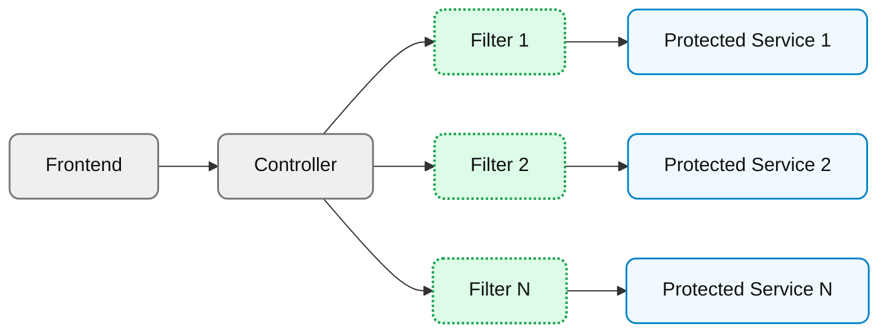
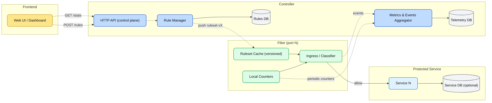

# Welcome to Sinkhole

## Abstract

```mermaid
flowchart LR
    FE["Frontend"] --> CTRL["Controller"]
    CTRL --> F1["Filter 1"] & F2["Filter 2"] & F3["Filter N"]
    F1 --> S1["Protected Service 1"]
    F2 --> S2["Protected Service 2"]
    F3 --> S3["Protected Service N"]

     FE:::frontend
     CTRL:::controller
     F1:::filter
     F2:::filter
     F3:::filter
     S1:::service
     S2:::service
     S3:::service
    classDef frontend fill:#dbeafe,stroke:#2563eb,stroke-width:1.5px,color:#111,rx:8,ry:8
    classDef controller fill:#bfdbfe,stroke:#1d4ed8,stroke-width:1.5px,color:#111,rx:8,ry:8
    classDef filter fill:#dcfce7,stroke:#16a34a,stroke-width:1.5px,color:#111,rx:8,ry:8
    classDef service fill:#f0f9ff,stroke:#0284c7,stroke-width:1.5px,color:#111,rx:8,ry:8
    style FE fill:#efefef,stroke:#757575
    style CTRL fill:#efefef,stroke:#757575
    style F1 stroke-width:2px,stroke-dasharray: 2
    style F2 stroke-width:2px,stroke-dasharray: 2
    style F3 stroke-width:2px,stroke-dasharray: 2
```

```mermaid
flowchart LR
  %% ====== Styles ======
  classDef frontend   fill:#fde68a,stroke:#ca8a04,stroke-width:1.5px,color:#111,rx:8,ry:8
  classDef controller fill:#bfdbfe,stroke:#1d4ed8,stroke-width:1.5px,color:#111,rx:8,ry:8
  classDef filter     fill:#dcfce7,stroke:#16a34a,stroke-width:1.5px,color:#111,rx:8,ry:8
  classDef service    fill:#e0f2fe,stroke:#0284c7,stroke-width:1.5px,color:#111,rx:8,ry:8
  classDef store      fill:#f3f4f6,stroke:#6b7280,stroke-width:1.5px,color:#111,rx:8,ry:8

  %% ====== Frontend ======
  subgraph FE["Frontend"]
    UI["Web UI / Dashboard"]:::frontend
  end

  %% ====== Controller ======
  subgraph CTRL["Controller"]
    API["HTTP API (control plane)"]:::controller
    CFG["Rule Manager"]:::controller
    AGG["Metrics & Events Aggregator"]:::controller
    RDB[("Rules DB")]:::store
    TDB[("Telemetry DB")]:::store
  end

  %% ====== Filter ======
  subgraph FLT["Filter (port N)"]
    ING["Ingress / Classifier"]:::filter
    CACHE["Ruleset Cache (versioned)"]:::filter
    CNT["Local Counters"]:::filter
  end

  %% ====== Protected Service ======
  subgraph SVC["Protected Service"]
    APP["Service N"]:::service
    SDB[("Service DB (optional)")]:::store
  end

  %% ====== Control / Config Flow (dotted) ======
  UI -.->|GET /stats| API
  UI -.->|POST /rules| API
  API -.-> CFG
  CFG -.->|push ruleset vX| CACHE
  ING -.->|events| AGG
  CNT -.->|periodic counters| AGG

  %% ====== Data Path (solid) ======
  ING -->|allow| APP
  APP --> SDB

  %% ====== Internal wiring ======
  CFG --> RDB
  CACHE --> ING
  CNT --> ING
  AGG --> TDB
```
